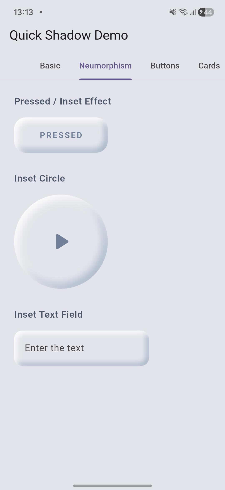
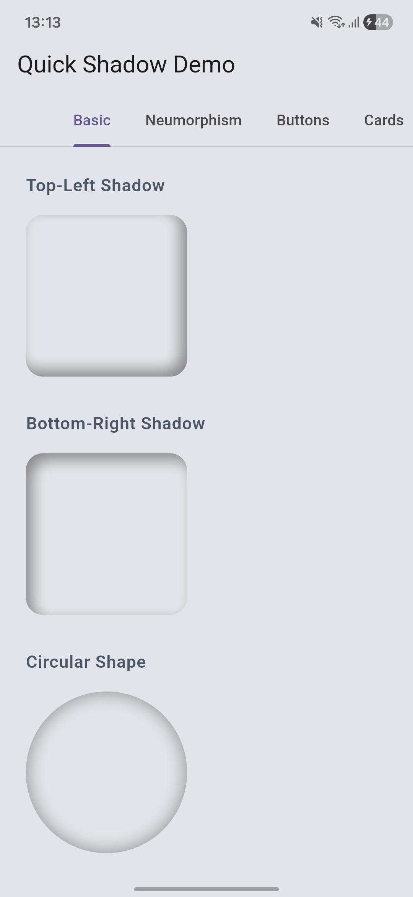
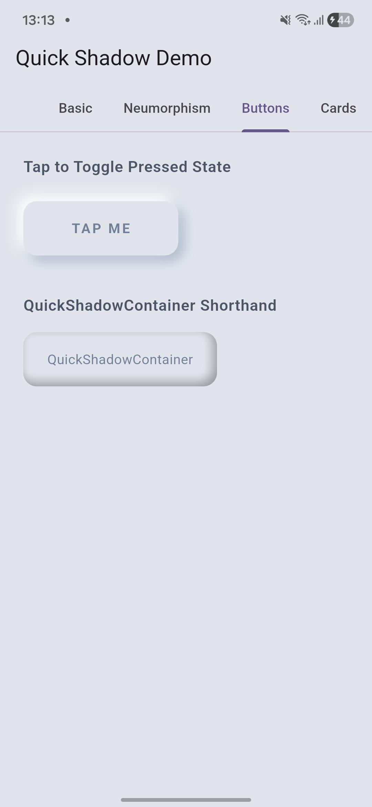
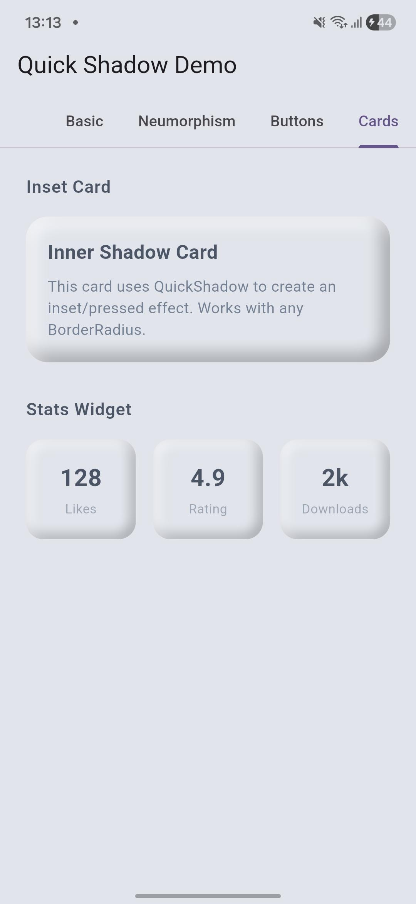

# quick_shadow

A Flutter package that adds **inner shadow** support to any widget — `Container`, `Button`, `Card`, and more.

Flutter's built-in `BoxDecoration` only supports **outer** shadows. This package fills that gap with a simple, performant `QuickShadow` widget using a Canvas-based even-odd path technique.

🚀 **[Try it Live](https://quickshadow.netlify.app)**

---

## Screenshots

<!-- 
  HOW TO ADD SCREENSHOTS:
  1. Take screenshots of your example app running
  2. Create a folder called `screenshots/` in your repo root
  3. Upload screenshots there on GitHub
  4. Replace the lines below with your actual image paths like:
     
     
-->

| Basic Shadow | Neumorphism | Button | Cards                              |
|---|---|--------------------------------------|------------------------------------|
|  |  |  |  |

---

## Features

- ✅ Inner shadow on **any widget**
- ✅ Supports **BorderRadius** (rounded corners & circles)
- ✅ **Multiple shadows** on a single widget
- ✅ Perfect for **Neumorphism UI**
- ✅ `QuickShadowContainer` convenience widget
- ✅ Zero external dependencies (pure Flutter)

---

## Getting Started

Add to your `pubspec.yaml`:

```yaml
dependencies:
  quick_shadow: ^0.0.3
```

Run:

```bash
flutter pub get
```

Then import in your Dart file:

```dart
import 'package:quick_shadow/quick_shadow.dart';
```

---

## Usage

### Basic Inner Shadow

```dart
QuickShadow(
shadows: [
Shadow(
color: Colors.black38,
blurRadius: 10,
offset: Offset(4, 4),
),
],
borderRadius: BorderRadius.circular(16),
child: Container(
width: 150,
height: 150,
decoration: BoxDecoration(
color: Color(0xFFE0E0E0),
borderRadius: BorderRadius.circular(16),
),
),
)
```

---

### Neumorphism — Pressed Effect

```dart
QuickShadow(
shadows: [
Shadow(color: Colors.black26, blurRadius: 12, offset: Offset(6, 6)),
Shadow(color: Colors.white70, blurRadius: 12, offset: Offset(-6, -6)),
],
borderRadius: BorderRadius.circular(20),
child: Container(
width: 160,
height: 60,
decoration: BoxDecoration(
color: Color(0xFFE0E5EC),
borderRadius: BorderRadius.circular(20),
),
alignment: Alignment.center,
child: Text('PRESSED'),
),
)
```

---

### QuickShadowContainer (Shorthand)

```dart
QuickShadowContainer(
width: 200,
height: 60,
decoration: BoxDecoration(
color: Color(0xFFE0E5EC),
borderRadius: BorderRadius.circular(14),
),
shadows: [
Shadow(
color: Colors.black26,
blurRadius: 10,
offset: Offset(4, 4),
),
],
alignment: Alignment.center,
child: Text('Hello Inner Shadow'),
)
```

---

### Circular Shape

```dart
QuickShadow(
shadows: [
Shadow(color: Colors.black26, blurRadius: 14, offset: Offset(6, 6)),
],
borderRadius: BorderRadius.circular(75),
child: Container(
width: 150,
height: 150,
decoration: BoxDecoration(
color: Color(0xFFE0E5EC),
shape: BoxShape.circle,
),
),
)
```

---

## API Reference

### `QuickShadow`

| Parameter | Type | Required | Description |
|---|---|---|---|
| `shadows` | `List<Shadow>` | ✅ | List of inner shadows to apply |
| `borderRadius` | `BorderRadius?` | ❌ | Match with child's border radius for proper clipping |
| `child` | `Widget` | ✅ | The widget to apply shadow to |

### `QuickShadowContainer`

| Parameter | Type | Required | Description |
|---|---|---|---|
| `shadows` | `List<Shadow>` | ✅ | List of inner shadows |
| `decoration` | `BoxDecoration` | ✅ | Box decoration (color, borderRadius, etc.) |
| `width` | `double?` | ❌ | Container width |
| `height` | `double?` | ❌ | Container height |
| `padding` | `EdgeInsetsGeometry?` | ❌ | Inner padding |
| `alignment` | `AlignmentGeometry?` | ❌ | Child alignment |
| `child` | `Widget?` | ❌ | Optional child widget |

---

## How Shadow Offset Works

| Offset | Shadow appears on |
|---|---|
| `Offset(4, 4)` | Top & Left inner edges |
| `Offset(-4, -4)` | Bottom & Right inner edges |
| Both together | All edges — neumorphism pressed look |

---

## Contributing

Found a bug or want a new feature?
Open an issue or PR at [GitHub](https://github.com/YOURUSERNAME/quick_shadow) — contributions are welcome!

## License

MIT License — see [LICENSE](LICENSE) file for details.